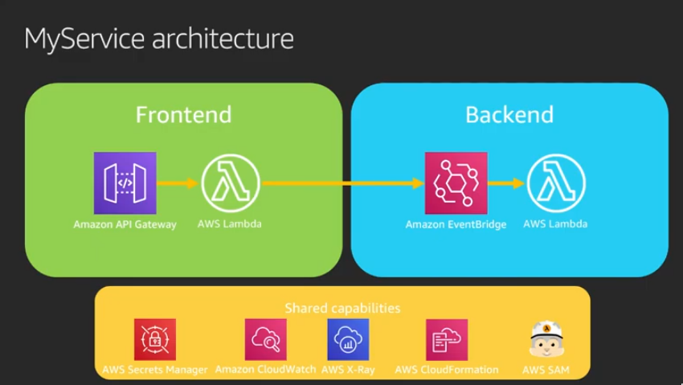
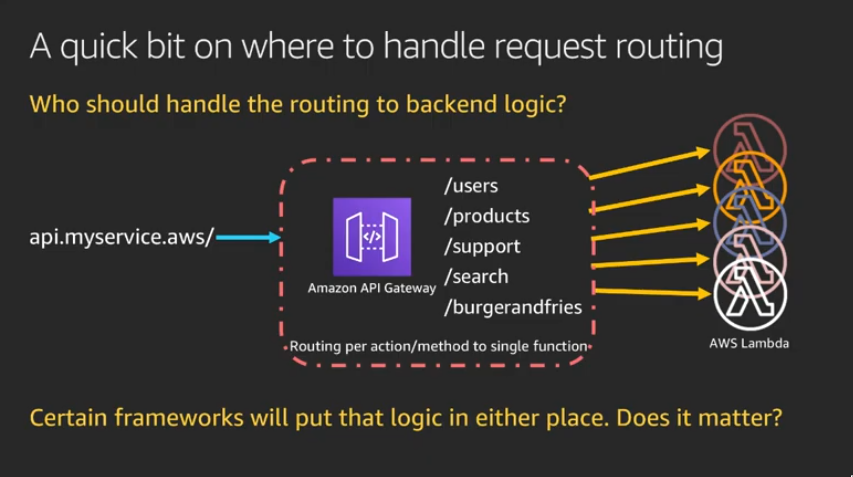
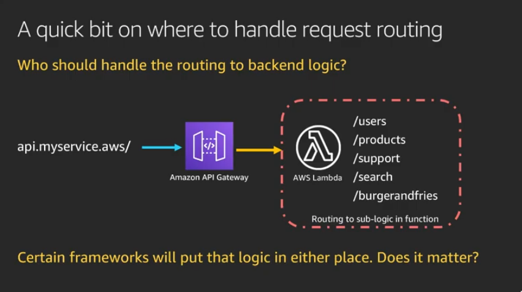
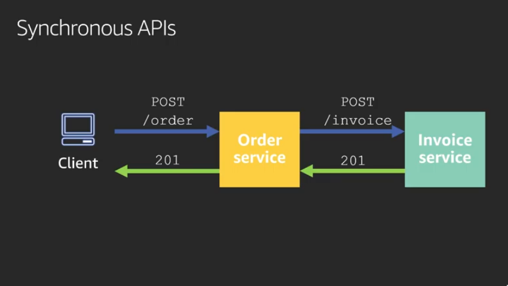
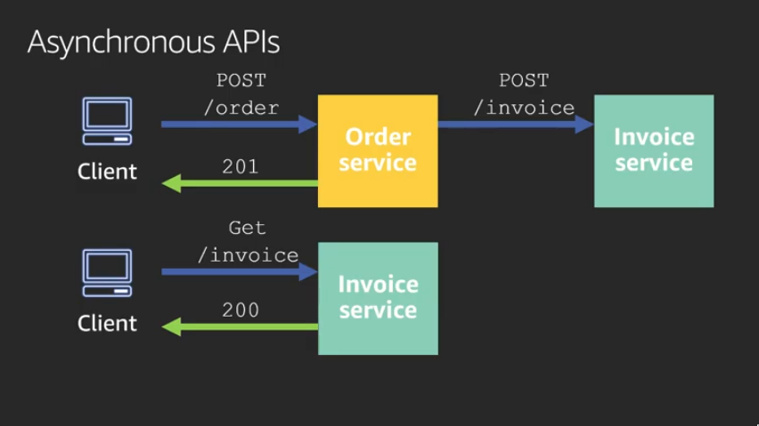
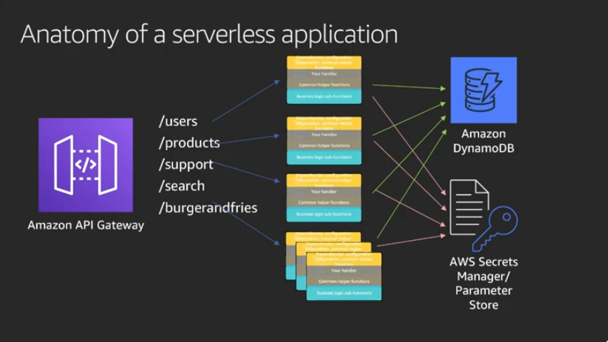

# Building Microservices with AWS Lambda

[AWS re:Invent 2019: [REPEAT 1] Building microservices with AWS Lambda (SVS343-R1)](https://www.youtube.com/watch?v=TOn0xhev0Uk)

## Request Routing

* Handles request routing inside Lambda function:

   * Security constructs applied to whole function
   * Performance settings treated as the whole
   * Limited amount of application size
   * Limited duration
   * The “Lambda-lith” can grow too in complexity, might need to rethink the whole logic routing model
   * Fewer cold starts? AWS needs to find available resources bootstrap the environment then starts executing the code
   * Fewer security constructs (IAM roles and policies)?
   * Take out the code that could be running in Lambda or container

* API Gateway

   * Using the benefits of API Gateway
   * Better compatibility with AWS’s tools
   * Better security granularity
   * Better performance granularity

## Async vs Sync
The time spent to try making a process async will pay for itself in you gaining a deeper understanding of what is really happening with your data.

* Sync Approach

    * Who handles failure and retry?
    * Who owns the retry? For how long?
    * This creates a “tight coupling” where failures are hard to recover from

* Async Approach

    * Service A immediately returns
    * Client has to handle talking to Service B

## Anatomy of a Serverless Application

* Note that in a microservices architecture, each service should persist its own states and data.
* Each Lambda function's configuration can be stored as environment variables and be injected at deployment time.
* A Lambda layer can be deployed to avoid code duplication, each Lambda function will have access to.
* Layer can be anything, dependencies, training data, configuration files.