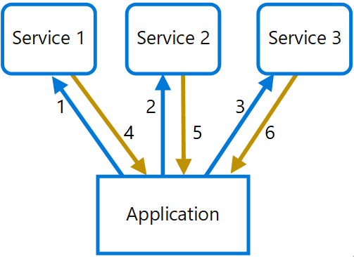
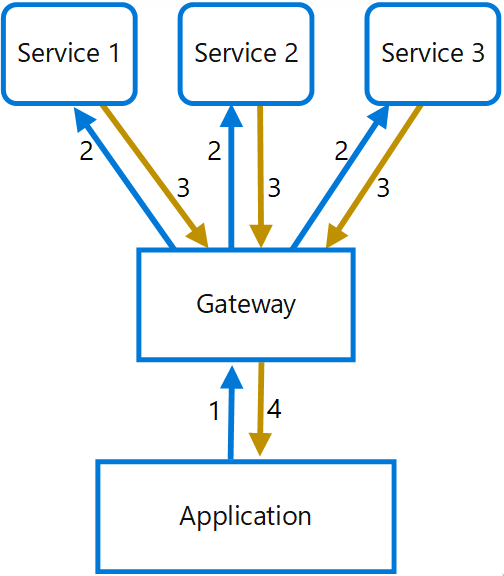
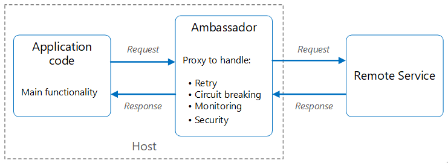
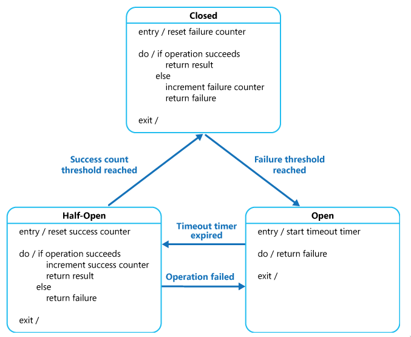

# Microservices architecture

[Microservices architecture style - Azure Application Architecture Guide](https://docs.microsoft.com/en-us/azure/architecture/guide/architecture-styles/microservices)

## Design principles of microservices
* Microservices are small independent loosely coupled, and can be maintained by different teams
* Each service is a separate codebase and can be deployed independently. Services are responsible for maintaining its own state and data persistence
* Services communicate with each other by using well defined APIs, internal implementation details should be hidden
* Services don’t need to share the same technology stack, libraries, or frameworks
* API gateway is the entry point for clients, instead of calling services directly, clients call the API gateway, which forwards to the appropriate services. API gateway should not have any domain knowledge, it should only handle request routing

### Pros
* Agility. Services are deployed independently, it’s easier to manage bug fixes and releases
* Scalability. Services can be scaled independently without the need to scale the whole application
* Fault tolerant. If a service is unavailable, it won’t disrupt the whole application, provided the upstream services are designed to handle fault correctly
* Data isolation. Easier to perform schema updates, where traditional monolithic application it can be very difficult because many parts of the application may touch the same data

### Cons
* Complexity. Each service may be simpler but the whole application as a whole is more complex
* Testing. Service dependencies can be difficult to test
* Network latency
* Data integrity. With microservices are responsible for its own data persistence, embrace eventual consistency where possible

## Design patterns

### Gateway aggregation
Use a gateway to aggregate multiple individual requests into a single request. This pattern is useful when a client must make multiple calls to different backend systems to perform an operation.

#### Problem
To perform a single task, a client may have to make multiple calls to various backend services. When any new feature or service is added to the application, additional requests are needed, further increasing resource requirements and network calls.

In the following diagram, the client sends requests to each service (1,2,3). Each service processes the request and sends the response back to the application (4,5,6). While each request may be done in parallel, the application must send, wait, and process data for each request, all on separate connections, increasing the chance of failure.



#### Solution
In the following diagram, the application sends a request to the gateway (1). The request contains a package of additional requests. The gateway decomposes these and processes each request by sending it to the relevant service (2). Each service returns a response to the gateway (3). The gateway combines the responses from each service and sends the response to the application (4). The application makes a single request and receives only a single response from the gateway.



#### Considerations
* The gateway should not introduce coupling with service.
* The gateway service may introduce a single point of failure.
* The gateway service may introduce bottleneck.
* Instead of building aggregation into the gateway, consider placing an aggregation service behind the gateway. Request aggregation will likely have different resource requirements than other services in the gateway and may impact the gateway's routing and offloading functionality.

### Ambassador
Create helper services that send network requests on behalf of a consumer service or application. An ambassador service can be thought of as an out-of-process proxy that is co-located with the client.



Deploy the proxy on the same host environment as your application to allow control over routing, resiliency, security features, and to avoid any host-related access restrictions (CORS).

### Circuit Breaker
Handle faults that might take a variable amount of time to recover from, when connecting to a remote service or resource. This can improve the stability and resiliency of an application.



The purpose of the Circuit Breaker pattern is different than the Retry pattern. The Retry pattern enables an application to retry an operation in the expectation that it'll succeed. The Circuit Breaker pattern prevents an application from performing an operation that is likely to fail. An application can combine these two patterns by using the Retry pattern to invoke an operation through a circuit breaker. However, the retry logic should be sensitive to any exceptions returned by the circuit breaker and abandon retry attempts if the circuit breaker indicates that a fault is not transient.

A Circuit Breaker shall act as a proxy for operations that might fail. It should monitor the number of recent failures and use this information to decide whether to allow operations to proceed. 

A Circuit Breaker has three states: **Closed**, **Open** and **Half-Open**.

* **Closed:**
  * The request from the application is routed to the operation.
  * The proxy maintains a counter of recent failed operations and increment the failed counter.
  * If the number of failed operations exceeds the specified threshold within a given period of time, the proxy is in **Open** state.
  * At this point the proxy starts a timeout timer, and when the timeout expires, it enters **Half-Open** state.
  * The purpose of timeout is to give the system time to fix the problem before allow the system to perform the operations again.

* **Open:** The operation from the application fails immediately and error/exception is returned.
* **Half-Open:**
  * A limited number of requests are allowed to perform the operation.
  * If these requests are successful, it is assumed that the system is recovered from previous failure and the proxy enters **Closed** state.
  * If any requests failed, the proxy enters **Open** state and restarts a timeout timer.
  The **Half-Open** state is useful to prevent a recovering service suddenly being flooded with request.

The Circuit Breaker pattern provides stability while the system recovers from a failure and minimizes the impact on performance. It can help to maintain the response time of the system by quickly rejecting a request for an operation that's likely to fail, rather than waiting for the operation to time out, or never return. 

```csharp
interface ICircuitBreakerStateStore
{
  CircuitBreakerStateEnum State { get; }

  Exception LastException { get; }

  DateTime LastStateChangedDateUtc { get; }

  void Trip(Exception ex);

  void Reset();

  void HalfOpen();

  bool IsClosed { get; }
}

public class CircuitBreaker
{
  private readonly ICircuitBreakerStateStore stateStore =
    CircuitBreakerStateStoreFactory.GetCircuitBreakerStateStore();

  private readonly object halfOpenSyncObject = new object ();

  public bool IsClosed { get { return stateStore.IsClosed; } }

  public bool IsOpen { get { return !IsClosed; } }

  public void ExecuteAction(Action action)
  {
    if (IsOpen)
    {
       // The circuit breaker is Open. Check if the Open timeout has expired.
      // If it has, set the state to HalfOpen. Another approach might be to
      // check for the HalfOpen state that had be set by some other operation.
      if (stateStore.LastStateChangedDateUtc + OpenToHalfOpenWaitTime < DateTime.UtcNow)
      {
        // The Open timeout has expired. Allow one operation to execute. Note that, in
        // this example, the circuit breaker is set to HalfOpen after being
        // in the Open state for some period of time. An alternative would be to set
        // this using some other approach such as a timer, test method, manually, and
        // so on, and check the state here to determine how to handle execution
        // of the action.
        // Limit the number of threads to be executed when the breaker is HalfOpen.
        // An alternative would be to use a more complex approach to determine which
        // threads or how many are allowed to execute, or to execute a simple test
        // method instead.
        bool lockTaken = false;
        try
        {
          Monitor.TryEnter(halfOpenSyncObject, ref lockTaken);
          if (lockTaken)
          {
            // Set the circuit breaker state to HalfOpen.
            stateStore.HalfOpen();

            // Attempt the operation.
            action();

            // If this action succeeds, reset the state and allow other operations.
            // In reality, instead of immediately returning to the Closed state, a counter
            // here would record the number of successful operations and return the
            // circuit breaker to the Closed state only after a specified number succeed.
            this.stateStore.Reset();
            return;
          }
        }
        catch (Exception ex)
        {
          // If there's still an exception, trip the breaker again immediately.
          this.stateStore.Trip(ex);

          // Throw the exception so that the caller knows which exception occurred.
          throw;
        }
        finally
        {
          if (lockTaken)
          {
            Monitor.Exit(halfOpenSyncObject);
          }
        }
      }
      // The Open timeout hasn't yet expired. Throw a CircuitBreakerOpen exception to
      // inform the caller that the call was not actually attempted,
      // and return the most recent exception received.
      throw new CircuitBreakerOpenException(stateStore.LastException);     // The circuit breaker is Open.
    }

    // The circuit breaker is Closed, execute the action.
    try
    {
      action();
    }
    catch (Exception ex)
    {
      // If an exception still occurs here, simply
      // retrip the breaker immediately.
      this.TrackException(ex);

      // Throw the exception so that the caller can tell
      // the type of exception that was thrown.
      throw;
    }
  }

  private void TrackException(Exception ex)
  {
    // For simplicity in this example, open the circuit breaker on the first exception.
    // In reality this would be more complex. A certain type of exception, such as one
    // that indicates a service is offline, might trip the circuit breaker immediately.
    // Alternatively it might count exceptions locally or across multiple instances and
    // use this value over time, or the exception/success ratio based on the exception
    // types, to open the circuit breaker.
    this.stateStore.Trip(ex);
  }
}
```

To use a ```CircuitBreaker``` object to protect an operation, an application creates an instance of the ```CircuitBreaker``` class and invokes the ```ExecuteAction``` method, specifying the operation to be performed as the parameter. The application should be prepared to catch the ```CircuitBreakerOpenException``` exception if the operation fails because the circuit breaker is open. 

```csharp
var breaker = new CircuitBreaker();

try
{
  breaker.ExecuteAction(() =>
  {
    // Operation protected by the circuit breaker.
    ...
  });
}
catch (CircuitBreakerOpenException ex)
{
  // Perform some different action when the breaker is open.
  // Last exception details are in the inner exception.
  ...
}
catch (Exception ex)
{
  ...
}
```