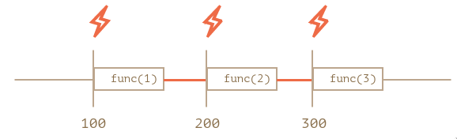
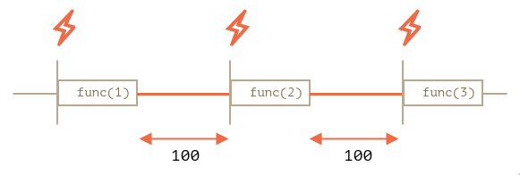

# React quick notes

## `useCallback` with no dependencies

The following function is wrapped in `useCallback`, but it doesn't have any dependencies.

```javascript
const updateChildren = useCallback(
  (id: string, item: ITreeItem, children: ITreeItem[]) => {
    if (item.id === id) {
      item.children.clear();
      children.forEach((child) => item.children.set(child.id, child));
      return;
    }
    for (const [, value] of item.children) {
      updateChildren(id, value, children);
    }
  },
  []
);
```

* Purpose of `useCallback` does not depend on if you have dependencies or not. It's to ensure referential integrity. To get better performance. Every time your component re-render, a new instance of the function is created, `useCallback` is just an addition which assigns the reference to another variable.
* When you wrap a function with useCallback it actually memorizing(remember the last execution result) and the next time you call this function it will return the last result if none of the values in the dependent array is changed.

## Nested `setTimeout` vs `setInterval`

Nested `setTimeout` allows to set the delay between the executions more precisely than `setInterval`.
```javascript
let i = 1;
setInterval(function() {
  func(i++);
}, 100);
```
```javascript
let i = 1;
setTimeout(function run() {
  func(i++);
  setTimeout(run, 100);
}, 100);
```
For `setInterval` the internal scheduler will run func(i++) every 100ms:



The real delay between `func` calls for `setInterval` is less than in the code.
That’s normal, because the time taken by `func`'s execution consumes a part of the interval.
It is possible that `func`'s execution turns out to be longer than we expected and takes more than 100ms.
In this case the engine waits for func to complete, then checks the scheduler and if the time is up, runs it again immediately.
In the edge case, if the function always executes longer than delay ms, then the calls will happen without a pause at all.

And here is the picture for the nested setTimeout:



The nested `setTimeout` guarantees the fixed delay (here 100ms).
That’s because a new call is planned at the end of the previous one.

## Cannot assign to 'current' because it i a read-only property

When using React's `useRef` hook, if it is initialised with `null` default value, then `tsserver` will complain about the error.

The reason is described [ in this comment ]( https://github.com/DefinitelyTyped/DefinitelyTyped/issues/31065#issuecomment-446425911).

*It's intentionally left readonly to ensure correct usage, even if it's not frozen. Refs initialized with `null` without specifically indicating you want to be able to assign `null` to it are interpreted as `refs` you want to be **managed by React** , i.e. React "owns" the current and you're just viewing it.*

*If you want a mutable `ref` object that starts with a `null` value, make sure to also give `| null` to the generic argument. That will make it mutable, because you "own" it and not React.*

## Difference between `e.currentTarget` and `e.target`

* `e.currentTarget` is the element the event is attached to.
* `e.target` is the element that triggers the event.

## Difference between `e.preventDefault` and `e.stopPropagation`

* `e.preventDefault` will stop the browser handling the event.
* `e.stopPropagation` will stop event bubbling up to the parent elements.
