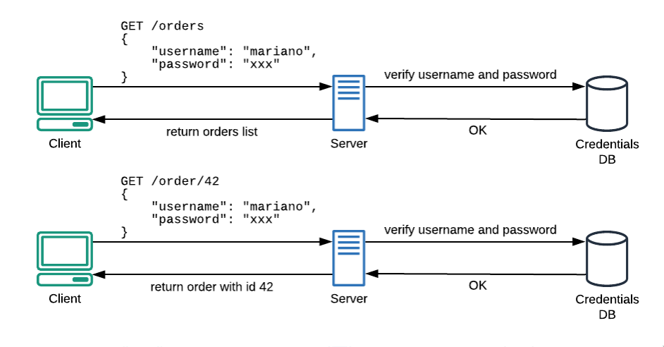
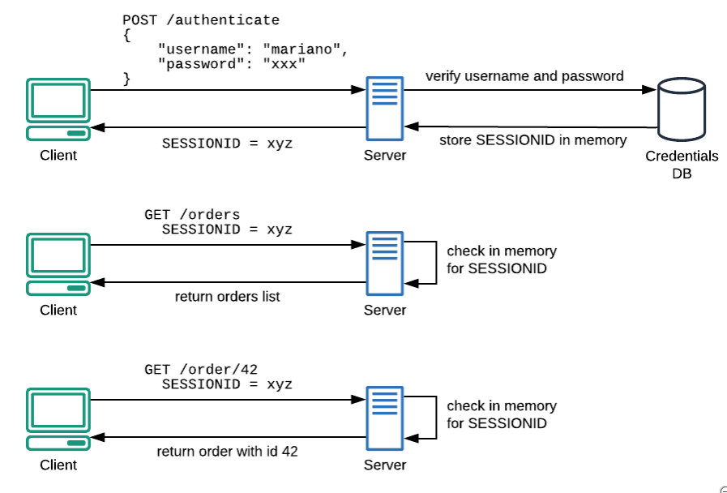
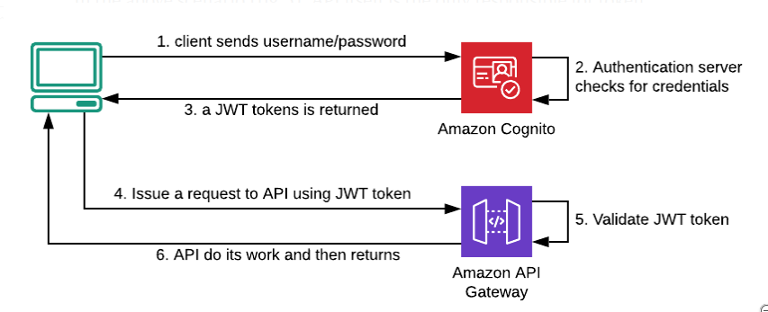

# JWT

[Why do we need the JSON Web Token (JWT) in the modern web?](https://medium.com/swlh/why-do-we-need-the-json-web-token-jwt-in-the-modern-web-8490a7284482)

## The Problem
The HTTP protocol is stateless, it means each request has no idea about the previous request, so we need to reauthenticate for each request.



The traditional way of solving the problem is to use server side sessions. Once the server checks username and password it will create a session id and save it in memory, the client will then use session id to communicate.



The solution isn’t scale, as the server needs to maintain a huge amount of sessions and multiple servers need to share all the session information.

## How JWT solves the problem

### JWT Content
JWT is self-contained, meaning all the information required by the server to approve or reject a request to an API.

A JWT has header, payload and signature.

The header section contains information about the token itself.
```json
{
 "kid": "ywdoAL4WL...rV4InvRo=",
 "alg": "RS256"
}
```
The above header explains the algorithm (alg) used to sign the token and the key (kid) we need to validate it.

The payload section contains information about the client (claims etc.).
```json
{
 [...]
 "iss": "https://cognito-idp.eu-west-1.amazonaws.com/XXX",
 "name": "Mariano Calandra",
 "admin": false
}
```
The iss property is a registered claim, it represents the identity provider that issues the token, in this case AWS cognito. We can add further claims based on our needs, such as “admin”.

The third section is signature, it is a hash that computed by the following step:
* Join with a dot the encoded header and the encoded payload;
* Hash the result using “alg” (RS256) and a private key;
* Encode the result as Base64URL;
```
data = base64UrlEncode(header) + "." + base64UrlEncode(payload);
hash = RS256(data, private_key);
signature = base64UrlEncode(hash);
```
Note that Base64URL is not an encryption algorithm, the payload is NOT encrypted, so DO NOT put sensitive information in the payload.

### JWT Validation
Since JWT is self-contained, we have all the information needed to validate the token. We now need to know how to get the public key to perform the validation.

Note that in asymmetric encryption, the public key is used to encrypt a message, private key is used to decrypt it. In the signing algorithm it is opposite. In a JWT data is signed using a private key and the public key is used to verify the data.

The iss property in a header is the endpoint of the issuer. Following the endpoint we get:
```json
{
 "keys": [
   {
     "alg": "RS256",
     "e": "AQAB",
     "kid": "ywdoAL4WL...rV4InvRo=",
     "kty": "RSA",
     "n": "m7uImGR -TRUNCATED AhaabmiCq5WMQ",
     "use": "sig"
   },
   {...}
 ]
}
```
In the keys array, search for the element with the same “kid” in a JWT’s header, the “e” and “n” are the public exponent and modulus that compute the public key.

At the first request, a client needs to contact the authentication server, sending username and password to it. If credentials are valid, a JWT token will be returned to the client that will use it to request an API.

